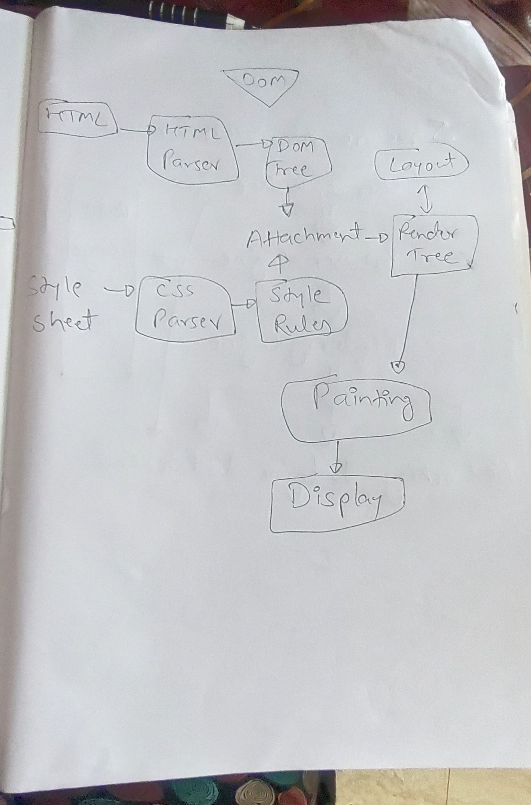

## How Browser works 

Whenever we enter a URI or URL in the browser it fetches the DNS record first from cache (which includes of Browser Cache - OS - Router - ISP ).If the record is not available it will look for that in the Root domain name server - Top level domain name server - 2nd level - 3rd level domain name server - IP.

Once it gets the IP it will initiate the TCP connection via 3 way handshake and creates an HTTP request. Once it gets a Server response it will start constructing the Render Tree and prepare a layout and Does the painting in browser that's how we see a webpage in the browser.

The Browser's main functionality is - 
1. Present the web resource we choose.
2. Web resource can be HTML document, it may also be a PDF, image, sheet, or some other type of document.
3. Location of document over web is specified by a URI. Which is used by the user to fetch the document.

Browser High level Structure -

1. User interface
2. Browser engine
3. Rendering Engine
4. Networking
5. UI backend
6. Javascript Interpreter
7. Data storage

Structure of Browser -
	
	
          

Rendering Engine and it's uses - 

1. Common Rendering Engine - IE - Trident
	Firefox - Gecko
	Safari - WebKit
	Chrome - Blink

2. Rendering Engine is used to parse HTML to construct

      1. a. Content tree  b. Style data c. Render Tree (DOM and CSSOM trees)

      2. DOM tree -> Render Tree Construction -> Layout of render tree -> painting the render tree

Parsers HTML and CSS etc.

	

Script processors ->

	

Tree construction -> 

	

Order of script processing - 

	Execution of Javascript programs - 
		1. Scripts
		2. Functions 
		3. Event handlers
		4. Onload and unload Handlers
		5. Javascript URLs
		6. Window and variable lifetime

Layout and Painting - 

	1. Layout process -> Giving each node the exact coordinates
	2. Painting -> The render tree will be traversed and each node will be painted using the UI backend layer.